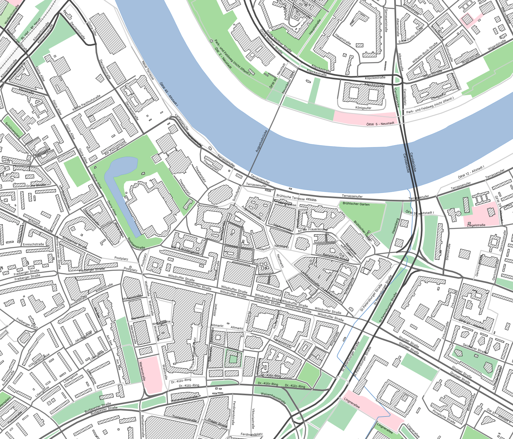

# GeoData
Some useful geodata for Dresden

## Geoportal

Dresden hat unter opendata.dresden.de auch GeoDaten als Web Feature Service bzw. teilweise als GeoJSON zur Verfügung gestellt. Das QGIS Projekt zeigt beispielhafte Darstellung der angebotenen Geodaten:

* [QGIS Projekt für GeoDaten](opendata.dresden.de.qgz)

## Files

* Stadtteile-Dresden.geojson Quelle: [OpenStreetMap](http://overpass-turbo.eu/s/cAU)
